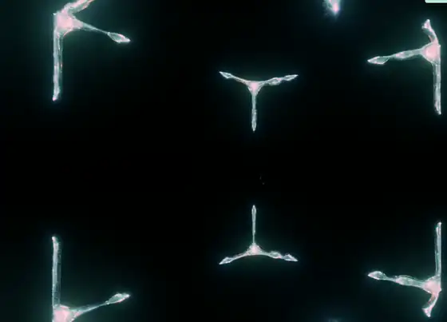
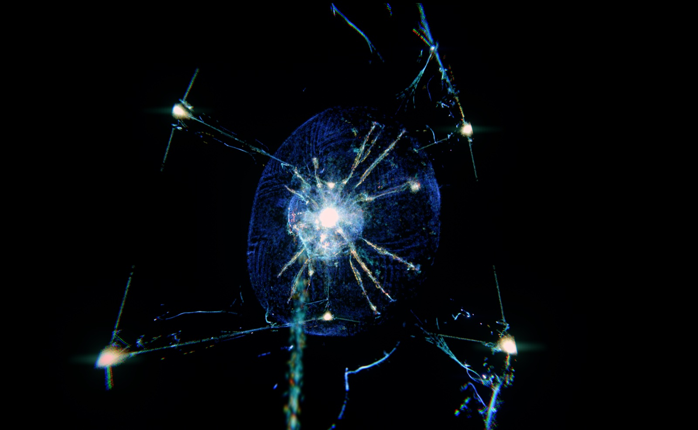
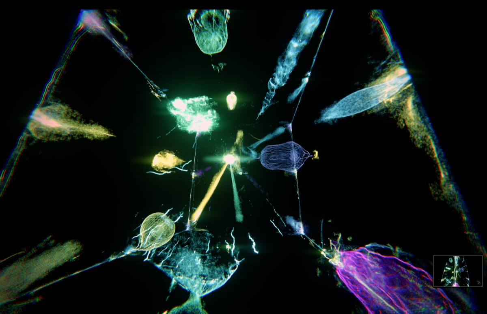
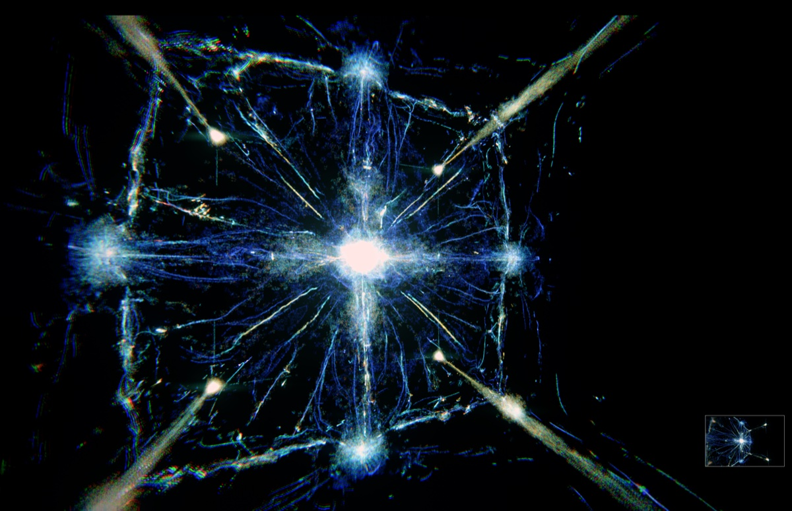

# 3D Life Sim

<p align="center">
  
  
</p>

A real-time, browser-based 3D particle life simulation powered by WebGPU. Hundreds of thousands of particles respond to a configurable local field, creating evolving swarms, filaments, shells, and emergent structures.

<p align="center">
  
  
  
</p>

## Live demo

<https://3d-life-sim.pages.dev>

## Requirements

- Node.js 22 or newer
- pnpm 10
- A WebGPU-capable browser

## Run locally

```bash
pnpm install
pnpm dev
```

Open the local URL Vite prints. The simulation starts automatically. Use the collapsed cockpit sections to change the particle physics, rendering, camera, audio modulation, and MIDI mappings.

Useful shortcuts:

- `F` — toggle fullscreen
- `M` — hide or show the cockpit
- `R` — start or stop a performance recording

The preset dropdown contains four bundled looks: `Default`, `Electric Current`, `Ice Flower`, and `Viridian Aurora`. `Save JSON` and `Load JSON` make presets portable without an account or server database. Imported preset files must be JSON and are limited to 1 MB; camera lock is always disabled when a preset loads.

## Audio reactivity

Any slider in the cockpit can be driven by live audio.

**Turning it on.** Open the `Audio` section (the badge next to the title shows `Off`, `Live`, `Blocked`, …) and click `Start microphone`. The browser asks for microphone permission once. Capture and analysis run entirely on your device in an `AudioWorklet` — audio is never uploaded and the app contacts no backend. Adding `?audio=mic` (or the legacy `?audio=1`) to the URL requests the microphone at launch.

**Picking an input source.** While capture is live, an `Input` dropdown lists the available devices (the system default is marked `· default`). Pick the microphone or loopback device you want analyzed.

**The three bands.** Incoming audio is split into `low`, `mid`, and `high` buckets, shown as live meters in the panel. Each band has four shaping controls that apply before any mapping:

- `gain` (0–8) — scales the band's level.
- `exp` (0.1–8) — response curve: values below 1 lift quiet material (more sensitive), values above 1 suppress everything but loud peaks (spikier).
- `attack ms` / `decay ms` (1–2000) — how fast the level rises toward a louder signal and falls after it passes.

The `Modulation` checkbox is the master switch for all audio mappings.

**Creating a mapping.** Click a slider's *label* to unfold its modulation editor. The first row has one checkbox per band — tick `low`, `mid`, or `high` (any combination) to let that band drive the slider — followed by the mapping's `min` and `max` output values. Band activity moves the slider between `min` and `max`; the loudest enabled band wins at any moment. The second row has a per-band gain multiplier (0–16) so the same band can hit different sliders with different strength. Mapped sliders are highlighted, and a mapping's range may deliberately exceed the slider's normal track — the track widens to match. Mappings are saved by `Save JSON`, so a preset can carry its whole audio-reactive setup (the bundled presets ship with none).

## MIDI control

**Enabling MIDI.** Open the `MIDI` section and click `Enable` — the browser asks for Web MIDI access (a WebMIDI-capable browser is required). `Refresh` re-scans after plugging in a controller. The badge shows `off`, `on`, or `learn`, and the readout at the bottom of the panel prints the last message received, which is handy for checking that a controller is talking.

**Picking a MIDI device.** The `Input` picker chooses which connected device is listened to — either `All inputs` or one specific device. This choice is a live filter for the current session.

**Mapping a control.** Open a slider's modulation editor (click its label) and find the `MIDI` row. Click `Learn`, then move a knob or fader on your controller — the first control message received is captured and the mapping is on. Knobs/faders (CC), pitch bend, channel pressure, and poly aftertouch all work. The row shows the captured identity (for example `CC 21 ch 1`), `Relearn` replaces it, `Clear` removes it, and the `On` checkbox temporarily disables a mapping without forgetting the control.

**Changing the mapping range.** The two number fields in the `MIDI` row are the mapping's `min` and `max`: the control's full physical travel maps linearly onto that range. Swap `min` and `max` to invert the direction, or use values outside the slider's normal range — like audio mappings, MIDI ranges are allowed to widen the track. Saved mappings match on message type, channel, and controller number rather than the device's identity, so a preset's mappings keep working when the same controller is plugged into a different port or machine.

## Development

```bash
pnpm check
```

This runs TypeScript checking, the unit test suite, and a production build.

For the complete gate, including the Chromium end-to-end suite:

```bash
pnpm exec playwright install chromium
pnpm check:all
```

## Deploy

The repository includes a Cloudflare Pages configuration:

```bash
pnpm deploy
```

## Project scope

This repository contains the static browser simulation, a particle-only public render path, four curated particle presets in [`Presets/`](Presets), and its automated tests. The bundled presets contain no MIDI mappings. Cache playback, alternate render-mode controls and presets, Philips Hue integration, native helpers, offline render tools, generated captures, private development notes, and the original monorepo history are intentionally excluded.

## License and attribution

The project is MIT licensed. Portions are derived from Jesse Gelders' MIT-licensed [Fluoddity](https://github.com/aphid91/Fluoddity), and the post-processing shader includes an MIT-licensed AgX implementation by Missing Deadlines (Benjamin Wrensch). See [THIRD_PARTY_NOTICES.md](THIRD_PARTY_NOTICES.md).
